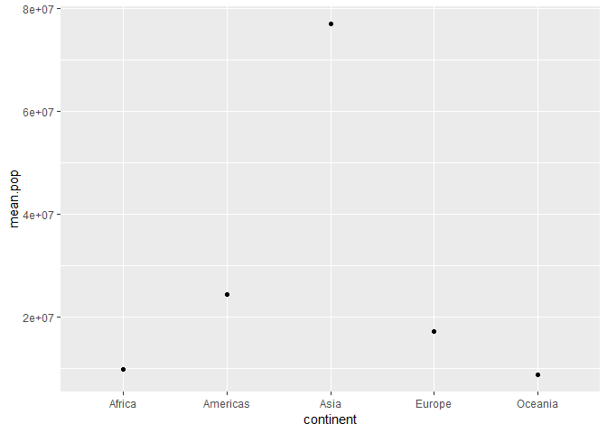

Homework 05: Factor and figure management
================
Stephen Chignell
October 19, 2018

-   [Overview](#overview)
-   [Part 1: Factor management](#part-1-factor-management)
-   [Exercise using gapminder](#exercise-using-gapminder)
    -   [Load libraries](#load-libraries)
    -   [Look at the data](#look-at-the-data)
    -   [Drop Oceania](#drop-oceania)
    -   [Reorder the levels of `country` or `continent`](#reorder-the-levels-of-country-or-continent)

Overview
--------

**Goals:**

-   Reorder a factor in a principled way based on the data and demonstrate the effect in arranged data and in figures.
-   Write some data to file and load it back into R.
-   Improve a figure (or make one from scratch), using new knowledge, e.g., control the color scheme, use factor levels, smoother mechanics.
-   Make a plotly visual.
-   Implement visualization design principles.

Part 1: Factor management
-------------------------

**Overview of factors**

Factors are “truly categorical” variables. They are vectors that:

-   have character entries on the surface (i.e. category/class name)
-   have integers underneath (i.e. code for computer to keep track)
-   have different levels (i.e., number of unique categories/classes)

Exercise using gapminder
------------------------

We will use the gapminder dataset to explore working with factors in the following ways:

-   Drop factor / levels
-   Reorder levels based on knowledge from data

#### Load libraries

``` r
suppressPackageStartupMessages(library(tidyr))
suppressPackageStartupMessages(library(dplyr))
suppressPackageStartupMessages(library(ggplot2))
suppressPackageStartupMessages(library(knitr))
suppressPackageStartupMessages(library(forcats))
suppressPackageStartupMessages(library(gapminder))
```

#### Look at the data

``` r
str(gapminder)
```

    ## Classes 'tbl_df', 'tbl' and 'data.frame':    1704 obs. of  6 variables:
    ##  $ country  : Factor w/ 142 levels "Afghanistan",..: 1 1 1 1 1 1 1 1 1 1 ...
    ##  $ continent: Factor w/ 5 levels "Africa","Americas",..: 3 3 3 3 3 3 3 3 3 3 ...
    ##  $ year     : int  1952 1957 1962 1967 1972 1977 1982 1987 1992 1997 ...
    ##  $ lifeExp  : num  28.8 30.3 32 34 36.1 ...
    ##  $ pop      : int  8425333 9240934 10267083 11537966 13079460 14880372 12881816 13867957 16317921 22227415 ...
    ##  $ gdpPercap: num  779 821 853 836 740 ...

This confirms that we have two factors, `country` (142 levels), and `continent` (5 levels).

#### Drop Oceania

Suppose we wanted to remove observations in the continent of **Oceania** from the dataset.

To start, we should review the names of the level using the `nlevels` function:

``` r
levels(gapminder$continent)
```

    ## [1] "Africa"   "Americas" "Asia"     "Europe"   "Oceania"

Next we filter the data. We can remove unused levels at the same time by piping the filter results into the `droplevels()` function:

``` r
gap_sans_OCE <- gapminder %>% 
  filter(continent != "Oceania") %>% 
  droplevels()
```

Now let's confirm there are no longer any "Oceania" rows:

``` r
NROW(gap_sans_OCE %>% 
  filter(continent == "Oceania"))
```

    ## [1] 0

Looks good! We can also check how many rows were dropped:

``` r
# Subtract to find difference
NROW(gapminder) - NROW(gap_sans_OCE)
```

    ## [1] 24

We have now confirmed that all "Oceania" rows (n=24) have been removed from the original dataset. What about the levels?

``` r
levels(gap_sans_OCE$continent)
```

    ## [1] "Africa"   "Americas" "Asia"     "Europe"

Great! We have successfully removed the unused levels.

#### Reorder the levels of `country` or `continent`

Suppose we wanted to plot mean life expectancy for each continent:

``` r
mean_pop <- gapminder %>%
  group_by(continent) %>% 
  summarize(mean.pop = mean(pop)) 
mean_pop
```

    ## # A tibble: 5 x 2
    ##   continent  mean.pop
    ##   <fct>         <dbl>
    ## 1 Africa     9916003.
    ## 2 Americas  24504795.
    ## 3 Asia      77038722.
    ## 4 Europe    17169765.
    ## 5 Oceania    8874672.

``` r
ggplot(mean_pop, aes(continent, mean.pop)) + 
  geom_point()
```



By default, the levels are ordered alphabetically, which does not help to highlight any patterns in the data.

We can change these to ascending order using the `fct_reorder` function:

``` r
mean_pop %>%
  mutate(continent = fct_reorder(continent, mean.pop)) %>% 
  ggplot(aes(continent, mean.pop)) + 
  geom_point()
```


